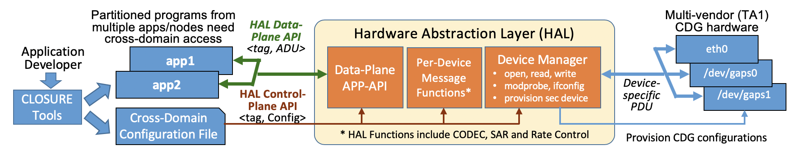

# Hardware Abstraction Layer
This repository hosts the open source components of the Hardware Abstraction Layer (HAL). HAL provides applications within a security enclave with a simple high-level interface to communicate with application in other enclaves. Based only on the application specified [*tag*](daemon#HAL-tag), the [HAL daemon](daemon#hal-daemon) routes *cross-domain* communication to its destination via Cross Domain Guard (CDG) hardware (where provisioned security policies are enforced).
#hal-architecture

The `master` branch contains the most recent public release software while `develop` contains bleeding-edge updates and work-in-progress features for use by beta testers and early adopters.

This repository is maintained by Perspecta Labs.

## Contents

- [Quick Start Guide](#quick-start-guide)
- [HAL Architecture](#hal-architecture)
- [HAL Installation and Usage](#hal-installation-and-usage)

## Quick Start Guide
### Download Sources, Build, and Install

We have built and tested HAL on a Linux Ubuntu 19.10 system, and while HAL can run on other operating systems / versions, the package installation instructions are for that particular OS and version.

Install the HAL pre-requisite libraries.
```
sudo apt install -y libzmq3-dev
sudo apt install -y libconfig-dev
```
See the [CLOSURE Dev Server Setup](https://github.com/gaps-closure/build/blob/master/environment_setup.md) for full listing of CLOSURE external dependencies (some of which may be required for HAL on a newly installed system).

Clone the repository, then run make in order to compile HAL, together with its libraries ([API](api/) and [codecs](appgen/)) and test programs:
```
git clone https://github.com/gaps-closure/hal
cd hal
make clean; make
```
Some SDH devices also require installation of a device driver via an associated kernel module. Consult the GAPS Device provider's documentation.

#### Static Binaries ####

To build a static version of you may need the additional packages for the included minimized static build of zmq
```
sudo apt install -y liblzma-dev
sudo apt install -y libunwind-dev
sudo apt install -y libsodium-dev
```

Once you have these dependencies you should simply need to run

```
make clean; make static
```

### Configure/Run HAL on Target Hardware

An instance of [HAL daemon](daemon#hal-daemon) runs on each host or server that directly utilizes the SDH (cross-domain host), and requires a configuration file. If GAPS devices are already configured on enclave hosts in the target environment, we can simply start HAL daemon with the appropriate configuration file in each enclave host:
```
hal$ daemon/hal test/sample_6modemo_b{e|w}_{orange|green}.cfg # e.g. sample_6modemo_be_orange.cfg
```
For this purpose, we have provided sample HAL daemon configuration files that model the Apr '20 demo setup, i.e., green-side and orange-side HAL configurations for either SDH-BE or SDH-BW usage. Note that provided configurations do not mix SDH types for the forward and reverse directions; we will provide these once the hybrid setup becomes available. Also note that contents of the config file may need to be changed depending on the target setup (i.e. SDH-BE device names and SDH-BW end-point IP addresses may differ from those used in current files).

Once the HAL daemon is started, we can run the mission application or a test application such as [halperf](#hal-test-driver-halperfpy) on each enclave.

### Quick Test of HAL with SDH-BE Loopback or SDH-BW Emulated Network

During development, for testing HAL with SDH-BE loopback drivers or SDH-BW emulated networking, it is possible to run HAL instances for the different enclaves on the same physical machine using their respective configurations. If running this localized setup and if using SDH-BE, the loopback ILIP device driver kernel module `gaps_ilip.ko` must be built and installed using `insmod` before starting HAL. 

```
# Obtain and untar driver source package from SDh-BE developer
cd loopback/ilip
# If using v0.2.0, edit line 426 in ilip_nl.c from #if 0  to  #if 1
vi ilip_nl.c
make clean; make install
insmod gaps_ilip.ko
```

If using SDH-BW, an emulated network (e.g., `test/6MoDemo_BW.net.sh` as shown below) must be configured before starting HAL to instantiate virtual ethernet devices and netcat processes to facilitate the packet movement. The `halperf` test application can then be invoked to send and receive the application traffic workload.

Steps for an end-to-end test for Apr '20 Demo testing on a single host are provided below.

1. Open five terminals (terminal1, terminal2, ... terminal5).
2. Assuming SDH-BW for this example; start the emulated network in terminal3 (skip for SDH-BE):
```
terminal3:
  hal$ cd tests
  hal/tests$: sudo ./6MoDemo_BW.net.sh
```
3. Start HAL (this example assumes SDH-BW) for green and orange enclaves
```
terminal1 (green):
  hal$ daemon/hal test/sample_6modemo_bw_green.cfg

terminal2 (orange):
  hal$ daemon/hal test/sample_6modemo_bw_orange.cfg
```
4. An instance of halperf.py can both send and receive messages. Run an instance on both green and orange enclaves and send the appropriate mux/sec/typ combinations that correspond to the Perspecta tag specification for the Mission App datatypes:
```
terminal4 (green):
  hal/test$ LD_LIBRARY_PATH=../appgen ./halperf.py -s 1 1 1 1 -r 2 2 1 -r 2 2 2 -i ipc:///tmp/halsubbwgreen -o ipc:///tmp/halpubbwgreen

terminal5 (orange):
  hal/test$ LD_LIBRARY_PATH=../appgen ./halperf.py -s 2 2 1 1 -s 2 2 2 1 -r 1 1 1 -i ipc:///tmp/halsubbworange -o ipc:///tmp/halpubbworange
  ```
Note the -i and -o arguments which correspond to input/ouptut ZMQ interfaces utilized by HAL. The example provided is for SDH-BW. If using SDH-BE, replace 'bw' with 'be' for each -i and -o argument (e.g. halpub<b>bw</b>orange --> halpub<b>be</b>orange)

The sending rates in the above calls are 1 Hz for simplicity. (For the representative mission application rates, you can send 1,1,1 at 100Hz, 2,2,1 at 10Hz, and 2,2,2 at 100Hz instead. Other rates and application mixes can be used for stress-testing or for testing policy rules.) Example output:
```
terminal4 (green):
sent: [1/1/1] -- (-74.574489,40.695545,102.100000)
recv: [2/2/2] -- (-1.021000,2.334000,0.900000)
recv: [2/2/1] -- (-74.574489,40.695545,102.400000)

terminal5 (orange):
recv: [1/1/1] -- (-74.574489,40.695545,102.100000)
sent: [2/2/2] -- (-1.021000,2.334000,0.900000)
sent: [2/2/1] -- (-74.574489,40.695545,102.400000)
```

### Cleanup of HAL Components
Ctrl-C can be used to kill most processes. Additional cleanup scripts are provided if needed:
```
hal/test$ ./kill_my_hall.sh f
hal/test$ sudo pkill -f "nc -klu"
hal/test$ sudo pkill -f "nc -u"
```

## HAL Architecture
HAL runs as a single daemon on the host, supporting multiple applications and GAPS devices, which we refer to as network interfaces in this document. Some GAPS devices HAL supports are, in fact, serial/character devices, even though we refer to them as network interfaces here. In the figure below, HAL's left interface connects to the applications, while its right interfaces connect (through the host's network interfaces) to the CDGs (residing either as a *bookend* (BE) on the same host as HAL or as a *bump-in-the-wire* (BW).



The HAL daemon has the following major components:
- [API](api/) to applications (*xdcomms C library*), which provide the high-level interface used by Applications to: a) send and receive Application Data Units (ADUs), and b) describe the ADU configuration. Using the ADU configuration description, the API uses the Application generated [Codecs](appgen/) to serialize (or de-serialize) the ADU before sending the packet to (or after receiving a packet from) HAL.
- [Data Plane Switch](daemon/), which forwards data to the correct interface based on the arriving packet's [**tag**](#HAL-tag) and the HAL configuration file mapping (**halmap**) rules.
- [Packetizer](daemon/), which converts between the internal HAL format (containing [tag](#HAL-tag) and ADU) and the different packet formats. Each CDG packet format has a separate sub-components that performs the encoding and decoding to and from the HAL internal format.
- [Device read and write](daemon/), which wait for packets on all the opened read devices and forward them based on the halmap forwarding table specified in the configuration file.
- [Device Manager](daemon/), which opens the devices specified in the configuration file. It also provisions the CDGs with security policies. 


Also included in the HAL directory are [test](test/) programs, which includes:
- **Application test**, which provides an example of sending and receiving different data types through HAL.
- **Halperf**, which emulates an application sending and receiving data through HAL at a specified rate. It also collects performance statistics.
- **HAL configuration files**, which a) define the supported device configurations, and b) define the halmap forwarding rules.
- **Simple network emulation**, which emulate the HAL devices and the remote HAL.

### HAL Tag
HAL communication contains only the Application Data Unit (ADU) and a small HAL tag.
The tag has three orthogonal identifiers: *<mux, sec, typ>*, where:
- **mux** is a session multiplexing handle used to identify a unidirectional applicaiton flow.
- **sec** identifies a CDG security policy used to processing an ADU. 
- **typ** identifies the type of ADU (based on DFDL xsd definition), which tells HAL how to serialize the ADU. The CDG can also use the tag *typ* (and its associated description) in order to process (e.g., downgrade) the ADU contents.

There are tags on the application side and tags on the network (GAPS device) side:
- The **Application tag**, which is used by the applicaitons and contained in the application packets (on the left side of HAL).
- The **Network tag**, which is used by the CDG components in the network, and contained in the network packets (on the right side of HAL).

HAL uses the tag to know how to route data to the correct interface using its configuration file mapping (**halmap**) rules. Also, the:
- Sending HAL will map the Applicaiton tag into the Network tag using its *halmap* rules.
- Receiving HAL will map the Network tag back into an Applicaiton tag using its *halmap* rules.

## HAL Installation and Usage

### Build HAL

See [Download Sources, Build, and Install](#download-sources-build-and-install) for required steps.

### Run HAL
Starting the HAL daemon requires specifying a HAL configuration file. The [test directory](test/) has examples of configuration files (with a .cfg) extension. 

#### HAL Command Options
To see the HAL daemon command options, run with the -h option.  Below shows the current options:
```
hal$ daemon/hal -h
Hardware Abstraction Layer (HAL) for gaps CLOSURE project
Usage: hal [OPTIONS]... CONFIG-FILE
OPTIONS: are one of the following:
 -h --help : print this message
 -v --hal_verbose : print debug messages to stderr
 -w --hal_verbose : device not ready (EAGAIN) wait time (microseconds) - default 1000us (-1 exits if not ready)
CONFIG-FILE: path to HAL configuration file (e.g., test/sample.cfg)
```

#### HAL Loopback Mode
At its simplest, we can start HAL to echo send requests made back on the application interface. Loopback mode is enabled by specifying the loopback configuration file [test/sample_loopback.cfg](test/sample_loopback.cfg)

```
cd hal
hal$ daemon/hal test/sample_loopback.cfg
```
In this case, HAL receives packets on its application read interface and routes them back to its application write interface. This requires no network devices (or network access).

Below is an example of the output from the HAL daemon, showing the configuratin of the :
- Single device called *xdd0*, using a pub/sub ipc connection (using connection mode sdh_ha_v1), with file descriptors 3 and 6 for reading and writing.
- A single HAL map (*halmap*) routing entry, which forwards application data from the application *xdd0* device with a HAL tag *<mux, sec, typ> = <1,1,1>* back to the application *xdd0* device. It also translates that tag to *<mux, sec, typ> = <1,2309737967,1>*
```
hal$ daemon/hal test/sample_loopback.cfg 
HAL device list:
 xdd0 [v=1 d=./zc/zc m=sdh_ha_v1 c=ipc mi=sub mo=pub fr=3 fw=6]
HAL map list (0x5597a6af8150):
 xdd0 [mux=01 sec=01 typ=01] ->  xdd0 [mux=01 sec=2309737967 typ=01] , codec=NULL

HAL Waiting for input on fds, 3
```
#### HAL Test Driver (halperf.py)
We provide an easy to use utility, <b>halperf.py</b>, for sending and receiving Mission App datatypes (Position/Distance) while utilizing HAL and SDH. halperf constructs an in-memory instance of the datatype, provides it to HAL with appropriate application [tag](#hal-tag), HAL maps it to the configured SDH, constructs the on-wire format, and releases a frame to the SDH. The receive-side HAL unrolls the frame and provides it to the receiving halperf instance.
```
usage: halperf.py [-h] [-s MUX SEC TYP RATE] [-r MUX SEC TYP] [-l PATH]
                  [-x PATH] [-i URI] [-o URI]

optional arguments:
  -h, --help            show this help message and exit
  -s MUX SEC TYP RATE, --send MUX SEC TYP RATE
                        send cross-domain flow using MUX/SEC/TYP at RATE (Hz)
  -r MUX SEC TYP, --recv MUX SEC TYP
                        recv cross-domain flow mapped to MUX/SEC/TYP
  -l PATH               path to mission app shared libraries
                        (default=../appgen)
  -x PATH               path to libxdcomms.so (default=../api)
  -i URI                in URI (default=ipc:///tmp/halpub1)
  -o URI                out URI (default=ipc:///tmp/halsub1)

```
