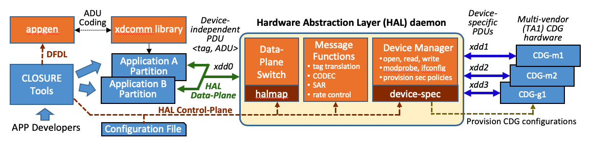

## HAL Daemon
The daemon directory contains the Hardware Abstraction Layer (HAL) Service components.
Based on its configuration file, the HAL daemon will:
- Open, configure and manage multiple interfaces.
- Route packets between interfaces, based on the configured *halmap*.
- Translate HAL [*tags*](#HAL-tag) in packet headers, based on the configured interface packet model.

To start the HAL daemon look at the [Quick Start Guide](../README.md#quick-start-guide) and [HAL Installation and Usage](../README.md#hal-installation-and-usage).

## Contents

- [HAL Architecture](#hal-architecture)
- [HAL Interface](#hal-interfaces)
- [HAL tag](#HAL-tag)
- [HAL Daemon Command Options](#HAL-Daemon-Command-Options)

## HAL Architecture
The HAL Service runs as a daemon, whicn can be [started manually](../README.md#configurerun-hal-on-target-hardware) or started by a systemd script at boot time.  



The HAL daemon is shown in the figure above supports multiple applications and Cross Domain Guards (CDGs). It provides three major functions:
- **Data Plane Switch**, which forwards packets (containing a tag and ADU) from one interface to another (e.g., from xdd0 to xdd1). Its forwarding in based on the arriving packet's interface name, the packet's [*tag*](#HAL-tag) value, and the HAL configuration file unidirectional mapping rules (**halmap**).  
- **Device Manager**, which opens, configures and manages the different types of interfaces (real or emulated):
  - Opening the devices specified in the configuration file, using each one's specified addressing/port and communication mode. 
  - Reading and writing packets. It waits for received packets on all the opened read interfaces (using a select() function) and transmits packets back out onto the halmap-specified write interface.
- **Message Functions**, which transform and control packets passing through HAL. Currently supported function include:
  - Tag translation between the internal HAL format and the different CDG packet formats. Each CDG packet format has a separate HAL sub-component that performs the tag encoding and decoding: e.g., [packetize_sdh_bw_v1.c](packetize_sdh_bw_v1.c) and [packetize_sdh_bw_v1.h](packetize_sdh_bw_v1.h).
  
## HAL Interfaces

In the figure above, HAL's left interface (xdd0) connects to the applications, while its right interfaces 
(e.g., xdd1) connect (through the host's devices) to the CDGs 
(residing either as a  *bookend* (BE) on the same host as HAL or as a *bump-in-the-wire* (BW).
HAL communicates with the application or guard using its host interfaces, which include: 
- Serial devices carrying TCP/IP packets (e.g., tty0).
- Network devices carrying either UDP or TCP packets (e.g., eth0) in client and/or server mode).
- ZeroMQ using IPC or INET (e.g., ipc:///tmp/halpub, ipc:///tmp/halsub).

HAL's interface to applications is through the [HAL-API](../api/). This *xdcomms C library* provides the high-level interface used by applications to: a) send and receive Application Data Units (ADUs), and b) describe the ADU configuration. Using the ADU configuration description, the API uses the Application generated [Codecs](../appgen/) to serialize (or de-serialize) the ADU before sending the packet to (or after receiving a packet from) HAL.

## HAL Tag
HAL packets from the application contain only the Application Data Unit (ADU) and a small HAL tag in the packet header.
The tag has three orthogonal identifiers: *<mux, sec, typ>*, where:
- **mux** is a session multiplexing handle used to identify a unidirectional application flow.
- **sec** identifies a CDG security policy used to processing an ADU. 
- **typ** identifies the type of ADU (based on DFDL xsd definition), which tells HAL how to serialize the ADU. The CDG can also use the tag *typ* (and its associated description) in order to process (e.g., downgrade) the ADU contents.

HAL encodes the application tags into the format used by the network (GAPS device):
- The **Application tag**, which is used by the applications (on the left side of HAL).
- The **Network tag**, which is used by the CDG components in the network, and contained in the network packets (on the right side of HAL).

HAL uses the tag to know how to route data to the correct interface using its configuration file mapping (**halmap**) rules. Also, the:
- Sending HAL will map the Application tag into the Network tag using its *halmap* rules.
- Receiving HAL will map the Network tag back into an Application tag using its *halmap* rules.


## HAL Daemon Command Options
To see the HAL daemon command options, run with the -h option.  Below shows the current options:
```
~/gaps/hal$ daemon/hal -h
Hardware Abstraction Layer (HAL) for GAPS CLOSURE project (version 0.11)
Usage: hal [OPTIONS]... CONFIG-FILE
OPTIONS: are one of the following:
 -f : log file name (default = no log file)
 -h : print this message
 -l : log level: 0=TRACE, 1=DEBUG, 2=INFO, 3=WARN, 4=ERROR, 5=FATAL (default = 0)
 -q : quiet: disable logging on stderr (default = enabled)
 -w : device not ready (EAGAIN) wait time in microseconds (default = 1000us): -1 exits if not ready
CONFIG-FILE: path to HAL configuration file (e.g., test/sample.cfg)
```

## Notes
If there are multiple HAL daemon instances on a node, then they must use different interfaces.

Planned HAL extensions include:
- Mediating  exchange between the application and the guard devices, handling the multiplexing/demultiplexing, segmentation/reassembly and rate control, as applicable.
- Configuring the cross domain guards.
- Performing device-specific ADU encoding/decoding.
