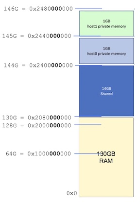

## Escape Performance Testing
This directory has software to copy blocks of data between application memory and mmapped ESCAPE shared memory, both on a single linux desktop and between two linux desktops. It compares ESCAPE performance with the performance when: a) using heap or mmapped memory on a single linux desktop, and b) the maximum memory bandwidth.

## Contents

- [ESCAPE LINUX CONFIGURATION](#escape-linux-config)
- [TEST PROGRAM](#test-program)


## TESTBED CONFIGURATION
The testbed uses the Intel *Extended Secure Capabilities Architecture Platform and Evaluation* System (ESCAPE Box). 
The system consists of two (Trenton single blade servers) laptops *escape-green* and *escape-orange*. 

[1] Intel, "Extended Secure Capabilities Architecture Platform and Evaluation (ESCAPE) System Bring Up Document," February 17, 2022.

Each laptop can access 16GB of shared memory on an FPGA card. 
The FPGA shared memory access is controled through a rule table within the FPGA, which can be configured to control which areas of memory that can be read and written by each laptop.

### Grub
The two laptops have Ubuntu 20.04.1 OS, with a 64-bit memory bus connected to 130 GB of local DDR4 memory with Bandwidth of 2933 MT/s. 
Each laptop therefore has a memory bandwidth of 2.933 x 8 = 23.46 GB/s.
Below shows the memory configuration file to add the 16 GB of FPGA shared memory and the resulting memory layout

```
$ cat /etc/default/grub
...
GRUB_DEFAULT=0
GRUB_TIMEOUT_STYLE=hidden
GRUB_TIMEOUT=0
GRUB_DISTRIBUTOR=`lsb_release -i -s 2> /dev/null || echo Debian`
GRUB_CMDLINE_LINUX_DEFAULT="quiet splash"
GRUB_CMDLINE_LINUX="memmap=16G\\\$130G"
```

The resulting memory map for each laptop is shown in the figure below 



## TEST Program
To see 


## TEST Program
Current results are shown below


!(fig_App_writes_to_escape-mmap.png "App writes to escape-mmap")
