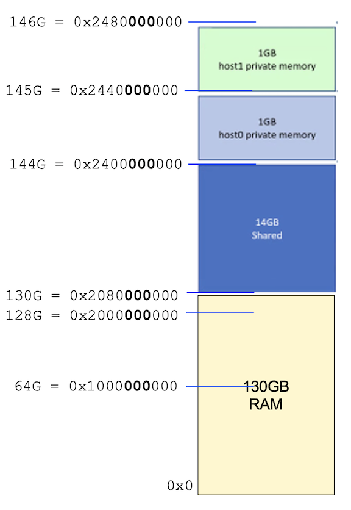
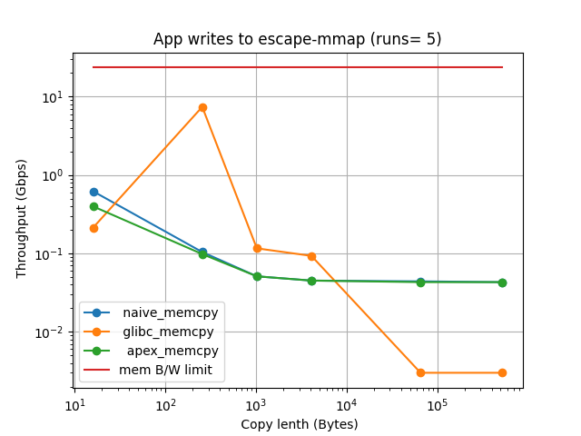
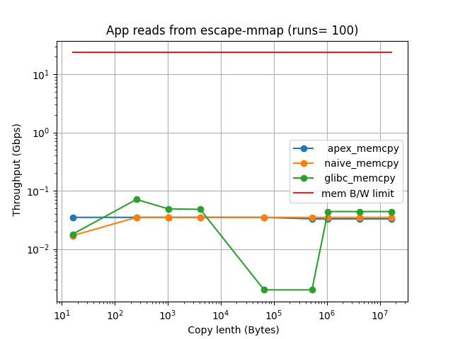
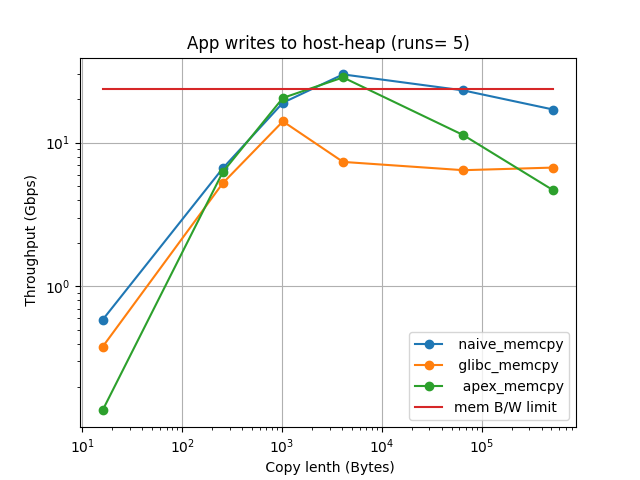
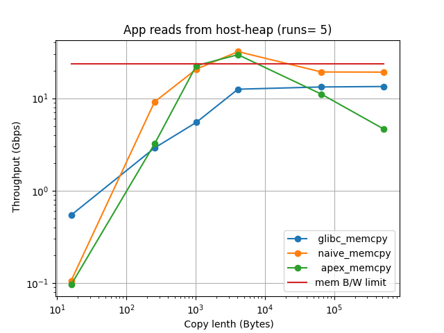
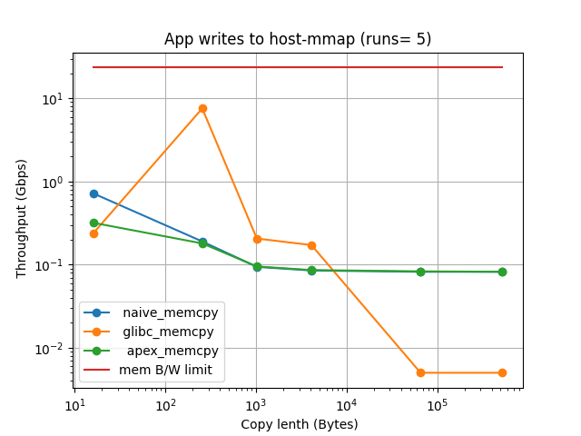
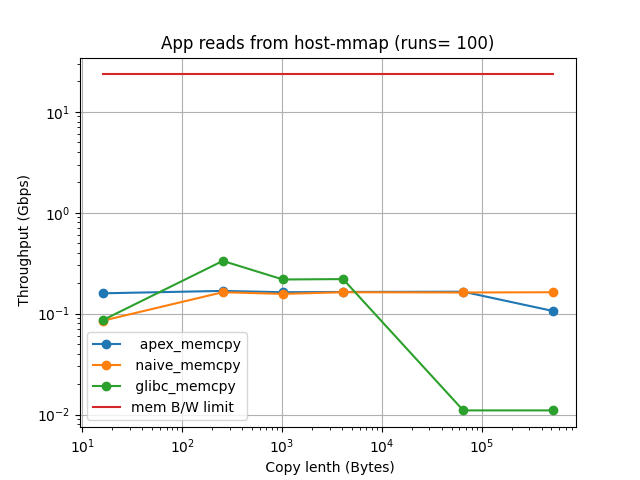

## Escape Performance Testing
This directory has software and example results of raw memory copy performance on the ESCAPE Box, without CLOSURE/HAL. 

## Contents

- [TESTBED SETUP](#testbed-setup)
- [TESTBED CONFIGURATION](#testbed-configuration)
- [TEST PROGRAM](#test-program)
- [RUN TEST PROGRAM AND PLOT SCRIPT](#run-test-program-and-plot-script)
- [EXAMPLE TEST RESULTS](#example-test-results)

## TESTBED SETUP
The testbed uses the Intel *Extended Secure Capabilities Architecture Platform and Evaluation* System (ESCAPE Box). 
The system consists of two (Trenton single blade servers) laptops *escape-green* and *escape-orange*. 

[1] Intel, "Extended Secure Capabilities Architecture Platform and Evaluation (ESCAPE) System Bring Up Document," February 17, 2022.

Each laptop can access 16GB of shared memory on an FPGA card. 
The FPGA shared memory access is controled through a rule table within the FPGA, which can be configured to control which areas of memory that can be read and written by each laptop.

## TESTBED CONFIGURATION
The two laptops have Ubuntu 20.04.1 OS, with a 64-bit memory bus connected to 130 GB of local DDR4 memory with Bandwidth of 2933 MT/s. 
Each laptop therefore has a memory bandwidth of 2.933 x 8 = 23.46 GB/s.
Below shows the memory configuration file to add the 16 GB of FPGA shared memory and the resulting memory layout

```
$ cat /etc/default/grub
...
GRUB_DEFAULT=0
GRUB_TIMEOUT_STYLE=hidden
GRUB_TIMEOUT=0
GRUB_DISTRIBUTOR=`lsb_release -i -s 2> /dev/null || echo Debian`
GRUB_CMDLINE_LINUX_DEFAULT="quiet splash"
GRUB_CMDLINE_LINUX="memmap=16G\\\$130G"
```

The resulting memory map for each laptop is shown in the figure below 



## TEST PROGRAM
The test program can run both a single ESCAPE box or between the two ESCAPE box machines (*escape-green* and *escape-orange*). It test memory throughput for varying:
1. Memory Pair Types
2. Payload Lengths.
3. Copy Functions.

There are currently six Memory pair types. The application data is always on the host heap (created using glibc malloc()). 
The applicaiton will read (or write) from (or to) one of three memory types:
1. Host heap: using malloc() from host memory.
2. Host mmap: using mmap() from host memory.
3. ESCAPE mmap: using mmap() from FPGA memory. 

Payload length are (by default) a range of lengths up to 16 GB (except for host mmap memory, which linux limits the allowed size)

The test program uses three copy functions:
1. glibc memory copy: memcpy().
2. naive memory copy: using incrementing unsigned long C pointers (*d++ = *s++).
3. Apex memory copy: https://www.codeproject.com/Articles/1110153/Apex-memmove-the-fastest-memcpy-memmove-on-x-x-EVE


It compares ESCAPE performance with the performance when: a) using heap or mmapped memory on a single linux desktop, and b) the maximum memory bandwidth.

## RUN TEST PROGRAM
The ESCAPE test program is in a singlefile: [memcpy_test.c](memcpy_test.c)
It links with the apex memory copy files: [apex_memmove.c](apex_memmove.c) [apex_memmove.h](apex_memmove.h)

To run the test program and plot the results type:
```
make && sudo ./memcpy_test  
```

Below shows the list of options the memory copy test program 
```
amcauley@escape-orange:~/gaps/build/hal/escape/perftests$ ./memcpy_test -h
Memory speed test for GAPS CLOSURE project
Usage: ./escape_test [OPTIONS]... [Experiment ID List]
OPTIONS: are one of the following:
 -h : print this message
 -i : which source data is initialized
   0 = all sources (default)
   1 = only if source is application - read on different node to write
 -n : number of length tests
 -o : source data initialization offset value (before writing)
 -r : number of test runs for each a) memory pair type, b) payload length and c) copy function
Experiment IDs (default runs all experiments):
   0 = write to host heap
   1 = read from host heap
   2 = write to host mmap
   3 = read from host mmap
   4 = write to shared escape mmap
   5 = read from shared escape mmap
```

## EXAMPLE TEST RESULTS
A simgple python script can plot the results from the ESCAPE test program: [results.csv](results.csv): The script [plot_xy.py](plot_xy.py) will both display the plots and save them into files.

To run the plot script simply type:
```
python3 plot_xy.py 
```
Current example plot result from a single ESCAPE box are shown below:












